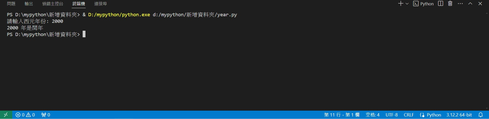
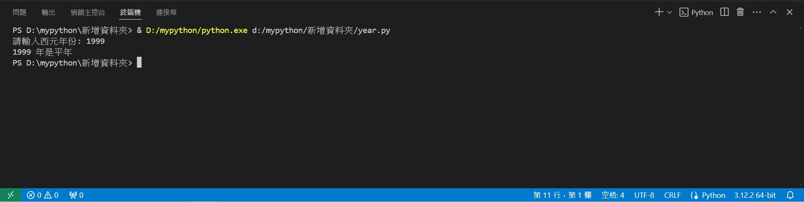
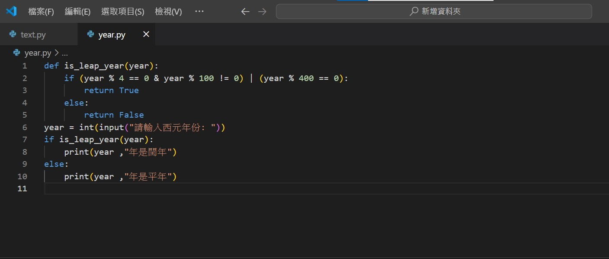

# PYTHON 期末報告
## 11124114黃安德,11124111王志節
# 題目三:判斷閏年
### 公元年份為4的倍數但非100的倍數或公元年份為400的倍數回傳```True``` 否則回傳```False```
```
def is_leap_year(year):
    if (year % 4 == 0 & year % 100 != 0) | (year % 400 == 0):
        return True
    else:
        return False
```
### 輸入公元年份並輸出```閏年```或是```平年```
```
year = int(input("請輸入西元年份: "))
if is_leap_year(year):
    print(year ,"年是閏年")
else:
    print(year ,"年是平年")
```
# 實例:回傳閏年

# 實例:回傳平年

# 實作介面(使用VS code)

